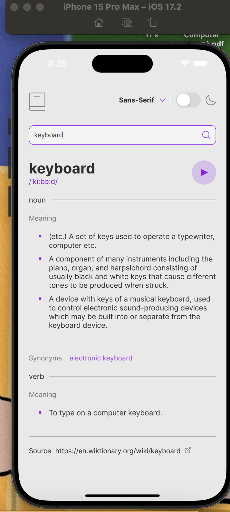

# 📚 LexiSearch - Cross-Platform Dictionary App

LexiSearch is a cross-platform mobile application developed using React Native, designed for seamless word search and language exploration. The app utilizes the Free Dictionary API to provide accurate word definitions, pronunciation, and example sentences.

## 🚀 Features
- **Word Search**: Look up any word to get its definition, pronunciation, and examples.
- **Audio Playback**: Listen to the correct pronunciation of each word.
- **Form Validation**: Ensures user input is valid before performing a search.
- **Customizable UI**: Dynamic font switching and theme adaptation for a better user experience.
- **Cross-Platform**: Works on both iOS and Android devices.

## 🛠️ Technologies Used
- **React Native**
- **JavaScript**
- **Expo**
- **Jest** (for testing)
- **Free Dictionary API**

# 🌐 Demo 

